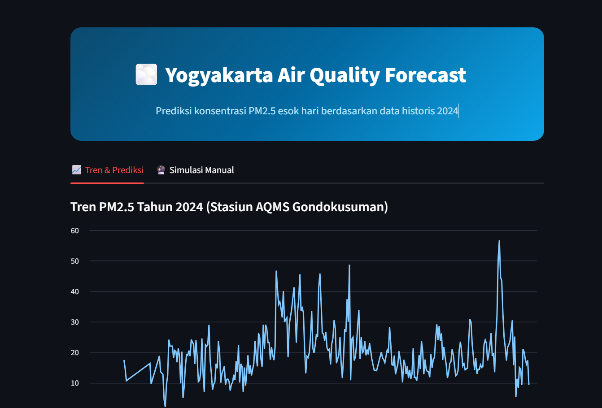

# 🌫️ Yogyakarta Air Quality Forecast: PM2.5 Regression Forecasting with Random Forest

<!-- Ganti baris di bawah dengan screenshot aplikasi kamu -->


A regression forecasting project that predicts next-day PM2.5 concentration in Yogyakarta using **scikit-learn (Random Forest)**, built on real 2024 air quality data published by **Dinas Lingkungan Hidup Kota Yogyakarta**. The project includes a full ETL pipeline (PDF → clean time series), documented feature/model selection, an honest comparison against a naive baseline, and an interactive **Streamlit** app.

---

[](https://yogyakarta-air-quality-forecast-using-randomforest-mqsapptnatq.streamlit.app/)
**Live Demo:** [Yogyakarta Air Quality Forecast](https://yogyakarta-air-quality-forecast-using-randomforest-mqsapptnatq.streamlit.app/)

## 🚀 Key Features

* **PDF-to-Dataset Pipeline:** Parses raw government PDF reports (daily AQMS concentration data + daily ISPU index data) into a single clean, calendar-complete daily CSV using `pdfplumber`.
* **Proper Time Series Handling:** Chronological (non-shuffled) train/test split, lag features, and rolling averages — no data leakage from the future into the past.
* **Baseline-Benchmarked Modeling:** Every model is compared against a naive **persistence baseline** ("tomorrow's PM2.5 = today's PM2.5") — a scientifically honest practice that's often skipped in portfolio projects, and a genuinely strong benchmark for short-horizon air quality forecasting.
* **Documented Model Selection:** `notebooks/eda_and_model_selection.py` is a reproducible, narrated log of every feature set tried (full multi-pollutant vs. minimal PM2.5-centric) and why the simpler model was ultimately shipped.
* **Interactive Forecast Dashboard:** Historical PM2.5 trend chart, rolling actual-vs-predicted comparison, and a manual "what-if" simulator where users can input hypothetical conditions to get an instant forecast.
* **ISPU-Style Health Categories:** Predictions are mapped to Indonesian air quality categories (Baik / Sedang / Tidak Sehat / Sangat Tidak Sehat / Berbahaya) with color-coded results.

---

## 🛠 Tech Stack

* **Frontend / UI:** Streamlit
* **Modeling:** scikit-learn (`RandomForestRegressor`), `joblib` for model persistence
* **Data Processing:** pandas, numpy
* **PDF Extraction (ETL):** pdfplumber

---

## 📁 Repository Structure

```text
├── result/                              # Screenshots and static assets for documentation
├── data/
│   └── yogyakarta_air_quality_2024.csv  # Clean, merged daily dataset (output of extract_data.py)
├── notebooks/
│   └── eda_and_model_selection.py       # Documented feature/model selection log
├── .gitignore                           # Git exclusion rules (model.joblib, venv, __pycache__)
├── README.md                            # Project documentation
├── extract_data.py                      # ETL: parses source PDFs into data/*.csv
├── train.py                             # Feature engineering, training, evaluation
├── app.py                               # Streamlit dashboard
├── model.joblib                         # Trained model artifact (generated locally, not committed)
├── metrics.json                         # Evaluation metrics (generated locally, not committed)
└── requirements.txt                      # Python dependencies
```

> **Note on source PDFs:** the raw government reports (`Data Konsentrasi Rata-Rata Harian AQMS`, `ISPU Kota Yogyakarta`) are not redistributed in this repo. They are open data — download the equivalent year's reports from Dinas Lingkungan Hidup Kota Yogyakarta or the Satu Data DIY portal (https://lingkunganhidup.jogjakota.go.id/page/index/basis-data-lingkungan-hidup/1000) and point `extract_data.py` at your local copies. The already-extracted `data/yogyakarta_air_quality_2024.csv` is committed so the app and training script run out of the box without needing the PDFs.

---

## 🧠 System Workflow

1. **Extraction:** `extract_data.py` parses two source PDFs — daily AQMS concentration data (PM10, PM2.5, SO2, CO, O3, NO2, HC) and daily ISPU index data — using `pdfplumber`, converting Indonesian-formatted numbers (`"17,58"` → `17.58`) and reindexing to a complete Jan 1–Dec 31, 2024 calendar.
2. **Feature Engineering:** `train.py` builds lag features (1–3 days), rolling averages (3/7-day windows), and calendar features (month, day-of-week) from the merged dataset.
3. **Model Selection:** `notebooks/eda_and_model_selection.py` documents a systematic comparison:

$$\text{Persistence Baseline} \quad\text{vs.}\quad \text{Full Multi-Pollutant Features} \quad\text{vs.}\quad \text{Minimal PM2.5-Centric Features}$$

   On this dataset's ~310 usable daily records, the full 33-feature multi-pollutant model overfits and underperforms; a compact 4-feature set (`pm25`, `pm25_lag1`, `pm25_roll3`, `month`) generalizes best.
4. **Training:** `train.py` trains a `RandomForestRegressor` on a chronological 80/20 split and saves the model plus evaluation metrics.
5. **Serving:** `app.py` loads the trained model and dataset to power an interactive Streamlit dashboard — historical trends, rolling forecast comparison, and a manual simulator.

---

## 📊 Model Performance

Evaluated on a chronological hold-out (last 20% of 2024, no shuffling):

| Model                              | MAE (µg/m³) | RMSE (µg/m³) | R²    |
|-------------------------------------|:-----------:|:------------:|:-----:|
| Persistence baseline (naive)        | 4.74        | 6.40         | 0.539 |
| Full multi-pollutant Random Forest  | 5.04        | 7.15         | 0.425 |
| **Final: PM2.5-centric Random Forest** | **4.72** | 6.55         | 0.517 |

The final model edges out the persistence baseline on MAE and stays close on RMSE/R² — a modest but honest improvement. Air quality forecasting over a single year of sparse station data is genuinely hard to beat with a naive baseline, and this project treats that as a finding to report rather than a result to hide. Run `python notebooks/eda_and_model_selection.py` to reproduce every row of this table yourself.

---

## ⚙️ Installation & Local Setup

1. **Clone this repository:**
```bash
git clone https://github.com/<your-username>/yogyakarta-air-quality-forecast.git
cd yogyakarta-air-quality-forecast
```

2. **Create and activate a virtual environment:**
```bash
python -m venv venv
source venv/bin/activate    # macOS / Linux
venv\Scripts\activate       # Windows
```

3. **Install dependencies:**
```bash
pip install -r requirements.txt
```

4. **(Optional) Regenerate the dataset from source PDFs:**
```bash
python extract_data.py
```
Skip this step to just use the already-committed `data/yogyakarta_air_quality_2024.csv`.

5. **Train the model:**
```bash
python train.py
```
This creates `model.joblib` and `metrics.json`.

6. **(Optional) Review the model selection log:**
```bash
python notebooks/eda_and_model_selection.py
```

7. **Run the Streamlit application:**
```bash
streamlit run app.py
```

---

## ☁️ Deployment Configuration (Streamlit Cloud)

1. Since `model.joblib` is not committed to the repo (see `.gitignore`), either:
   * Train locally and temporarily commit `model.joblib` for the simplest deployment (remove it from `.gitignore` first), **or**
   * Add a small startup check in `app.py` that runs `train.py` automatically if `model.joblib` is missing.
2. Set the main file path to `app.py`.
3. No API keys or secrets are required — everything runs on the committed CSV and locally trained model.
4. Deploy the application.

---

## 👤 Author

* **GitHub:** [@your-username](https://github.com/your-username)
* **Data Source:** Dinas Lingkungan Hidup Kota Yogyakarta, Tahun 2024
